  

 

 

Visitor's Count :

  <!--  -->
  

<h4 align="center">I debug life the same way I debug code with patience, caffeine, and a bit of panic.</h4>

 

 
<h3 align="left">Languages and Tools:</h3>

 

<h3>My Trophy Case</h3>

<h3>My GitHub Stats</h3>

   

       

&nbsp;

        

&nbsp;

&nbsp;

